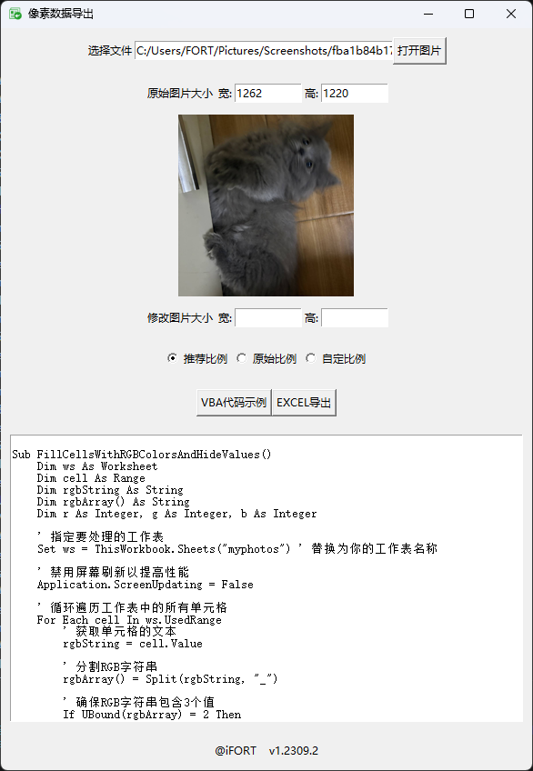

# 🖼️ 像素数据导出工具 (ImgToExcl)

> **一个将图片像素数据导出为Excel表格的Python小工具**  
> *用最朴素的方式，让图片“数据化”*

[](https://www.python.org/)
[](LICENSE)
[](https://docs.python.org/3/library/tkinter.html)

---

## 📖 简介

这是我在学习 Python 早期写的一个小工具。它做的事情很简单：

**把一张图片的每一个像素的 RGB 颜色值，导出成一个 Excel 表格。**

每个单元格记录一个像素的颜色信息（格式为 `R_G_B`），并附赠一段 VBA 脚本，可以在 Excel 里把这些数据还原成彩色单元格，让数据“活起来”。

虽然现在看来代码有些稚嫩，但它是我的第一个完整 GUI 项目，记录了一段从想法到实现的成长过程。**把它留在这里，作为一个纪念。**

---

## ✨ 功能特点

- ✅ 支持常见图片格式：`.png` `.jpg` `.jpeg` `.gif` `.bmp` `.tif` `.tiff` 等
- ✅ 三种导出尺寸模式：
  - **推荐比例** — 自动缩放到适合预览的大小（约 200px）
  - **原始比例** — 保持图片原始尺寸
  - **自定义比例** — 手动指定导出宽高
- ✅ 实时图片预览
- ✅ 一键导出为 `.xlsx` Excel 文件
- ✅ 内置 VBA 代码示例，可一键复制，用于在 Excel 中还原颜色
- ✅ 纯 Python + Tkinter，无需额外环境，开箱即用

---

## 🚀 快速开始

### 环境要求

- Python 3.10+
- pip

### 安装依赖

```bash
pip install -r requirements.txt
```

依赖列表：

- `Pillow` — 图片处理
- `openpyxl` — Excel 读写
- `numpy` — 数组操作

### 运行程序

```bash
python main.py
```

### 打包为独立 EXE（可选）

```bash
pyinstaller --onefile --noconsole --icon=your_icon.ico main.py
```

---

## 🎮 使用说明

### 界面预览



### 操作步骤

1. **打开图片** — 点击“打开图片”按钮，选择一张图片
2. **选择尺寸模式** — 在“推荐比例/原始比例/自定义比例”中选择
3. **（可选）调整尺寸** — 如果选择“自定义比例”，手动输入宽和高
4. **导出 Excel** — 点击“EXCEL导出”按钮
5. **（可选）获取 VBA 代码** — 点击“VBA代码示例”查看并复制代码

### 在 Excel 中使用 VBA 还原颜色

1. 打开导出的 `.xlsx` 文件
2. 按 `Alt + F11` 打开 VBA 编辑器
3. 插入模块，粘贴 VBA 代码
4. 运行 `FillCellsWithRGBColorsAndHideValues()` 宏
5. 每个单元格会变成对应的颜色，数据值被清空

> 💡 **提示**：将 Excel 单元格设置为正方形，视觉效果最佳。  
> 推荐设置：行高 12，列宽 1.44（约 20 像素）

---

## 📁 项目结构

```
pixel-data-exporter/
├── main.py              # 主程序入口
├── requirements.txt     # 依赖列表
├── README.md            # 项目说明
└── screenshot.png       # 界面截图（可选）
```

---

## 🧠 设计思路

这个工具诞生的初衷很简单：

> 我很好奇 — 一张图片，如果拆成数据，长什么样？

于是就有了它：

1. 用 `Pillow` 读取图片像素
2. 用 `numpy` 处理 RGB 数组
3. 用 `openpyxl` 写入 Excel 表格
4. 用 `Tkinter` 搭一个简单的界面

整个项目没有复杂的架构，就是一个“把想法变成工具”的朴素过程。  
**如果有机会重写，我会用 PyQt5 重做 UI，让界面更精致。**

---

## 📝 关于代码

这个项目写于 2023 年 9 月，是我早期学习 Python 时的作品。  
代码风格也许不够优雅，结构也许有些混乱，但它记录了一段真实的成长轨迹。

如果你也有类似的“早期作品”，欢迎一起分享、交流。  
**每一行代码，都是来时的路。**

---

## 🔧 已知问题 & 改进方向

- [ ] 界面可以更现代化（考虑迁移到 PyQt5 / PySide6）
- [ ] 导出大图片时性能有待优化
- [ ] 支持更多导出格式（CSV、JSON 等）
- [ ] 增加批处理功能（一次处理多张图片）
- [ ] 更好的错误处理和进度反馈

---

## 🤝 贡献

这是一个“纪念品”项目，欢迎 Fork 或提交 Issue，但可能不会频繁更新。  
如果你想在此基础上继续开发，非常欢迎！

---

## 🙏 致谢

- [Pillow](https://python-pillow.org/) — 图片处理的基石
- [OpenPyXL](https://openpyxl.readthedocs.io/) — Excel 读写神器
- [Tkinter](https://docs.python.org/3/library/tkinter.html) — Python 自带的 GUI 工具

---

## ✍️ 最后

> *“把代码写下来，是为了记住当时的自己。”*

—— iFORT, 2026

---

*Happy Coding! 🐍*
